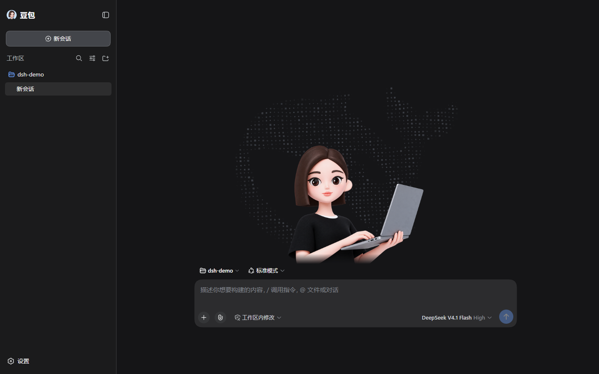

# dsh-theme-doubao

给 [DeepSeek Harness](https://www.deepseek.com/harness/) 的网页界面换一套豆包皮肤。


## 做了什么

- 侧栏左上角原本的 DeepSeek 标志和名字，换成豆包图标和「豆包」
- 新会话页面换成豆包人物，人物背后是一层点组成的 DeepSeek 鲸鱼，鼠标划过去点会散开

浅色和深色主题都做了适配，窗口随便拉都不会错位。

| 深色主题 | 鼠标划过 |
| --- | --- |
|  |  |


## 安装

```bash
dsh plugin --profile web add github:zdz6215591/dsh-theme-doubao
```

装完**重启 DSH**，再刷新页面。

以后想更新到最新版，再跑一次同样的命令就行：

```bash
dsh plugin --profile web add github:zdz6215591/dsh-theme-doubao
```

卸载：

```bash
dsh plugin --profile web remove dsh-theme-doubao
```

## 想改点什么

| 想改 | 改哪里 |
| --- | --- |
| 换成别的人物图片 | 替换 `assets/doubao-character.png`（透明背景 PNG） |
| 人物大小、位置 | `src/client/hero.js` 顶部的 `CONFIG` |
| 点的颜色、浓淡 | `src/client/hero.js` 的 `appearanceFor()` |
| 点的疏密、鼠标力度 | `src/client/digitile.js` 顶部的常量 |

改完重新打包一次：

```bash
node tools/build-client.mjs
```

## 目录

```
assets/         图片素材
src/client/     源码
client/         打包产物（安装时用的就是它）
lib/            DSH 插件入口
docs/           截图
tools/          打包和调试用的小工具
```

## 说明

这是个非官方的个人项目，和豆包 / 字节跳动、DeepSeek 深度求索都没有关系，也没有得到它们的授权。
`assets/` 里的豆包图标、人物和 DeepSeek 鲸鱼，版权属于各自的权利人，只是渲染时在本地用了一下。
代码部分是 MIT，见 [LICENSE](LICENSE)。
